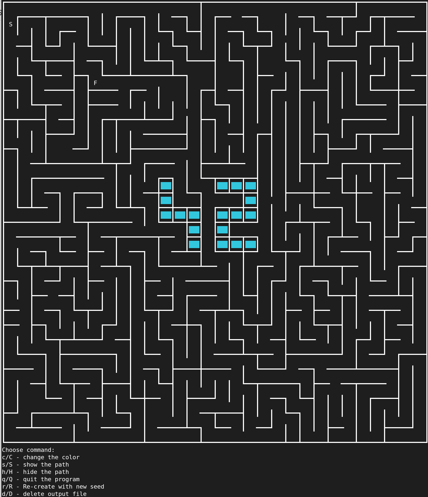

# A-Maze-ing

*This project has been created as part of the 42 curriculum by vlprysia, obirukov.*


## Description
A-Maze-ing is a procedural maze generator written in Python that creates, displays, and solves mazes. The project parses a configuration file to generate a maze, ensures there is a valid path from the entry to the exit, and visualizes the result interactively in the terminal. As a bonus, this project includes animations during the maze generation and pathfinding phases.

## Instructions
### Prerequisites
- Python 3.13.

### Installation & Execution
You can use the provided `Makefile` to manage the project:
- **Install dependencies:** `make install`
- **Run the program:** `make run` or execute directly via `python3 a_maze_ing.py config.txt`
- **Clean cache:** `make clean`
- **Build the reusable package:** `make build` (creates the pip module `.whl` / `.tar.gz`)


## Quick Start
```bash
make run
```

## Configuration File Format
The program relies on a plain text configuration file. 
- The file contains one `KEY=VALUE` pair per line.
- Lines starting with `#` are ignored as comments.

**Mandatory Keys**:
- `WIDTH` / `HEIGHT`: Maze dimensions (number of cells).
- `ENTRY` / `EXIT`: Coordinates `(x,y)` for the start and end points.
- `OUTPUT_FILE`: The name of the file where the maze data will be saved.
- `PERFECT`: Boolean value (`True`/`False`) defining if the maze has exactly one unique path.

## Algorithm
We chose the **Recursive Backtracker** algorithm for our maze generation. We selected this algorithm because it is widely considered the easiest and most intuitive way to create a structured maze. 

Our generator primarily creates "perfect" mazes (a single valid path). When an imperfect maze is required, we intentionally delete random walls to create loops and multiple paths.

## Visual Representation & Interactions
The maze is rendered in the terminal using ASCII characters by default. You can also enable Unicode rendering by running the program with the `--pretty` flag.

Users can interact with the generated maze using the following menu:
```text
Choose command:
c/C - change the color
s/S - show the path
h/H - hide the path
q/Q - quit the program
r/R - Re-create with new seed
d/D - delete output file
